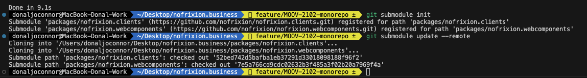

# 🗄️ MoneyMoov for Business Workspace

Welcome to the MoneyMoov for Business Workspace

This repo uses a pnpm [workspace](https://pnpm.io/workspaces) to manage the workspace. This means that you can run `pnpm install` from the root of the project to install all dependencies for all packages.

### Included Packages

[nofrixion.business](https://bitbucket.org/nofrixion/nofrixion.business/src/develop/) - The root project.

[nofrixion.clients](https://github.com/nofrixion/nofrixion.clients). A Git Sub Module linking to the nofrixion.clients repo.

[nofrixion.webcomponents](https://github.com/nofrixion/nofrixion.webcomponents). A Git Sub Module linking to the nofrixion.webcomponents repo.

### 🏁 Getting Started

To get started, clone this repo and run the following from the root of the project.

```bash
# Initialise the submodules
git submodule init

# Update the submodules
git submodule update --remote

# Install pnpm
npm install -g pnpm

# Install dependencies
pnpm install
```

This will install all dependencies for all packages and initialize the submodules.



If you look in the packages folder you will see the `nofrixion.clients` and `nofrixion.wecomponents` available.

You are now ready to start developing!

### 💾 Development

`pnpm` has some useful commands for developing with workspaces.

These include commands that allow you to execute scripts in a package from the root of the project.

#### Running the build script in a package

`pnpm` uses the name of the package in the `package.json` to determine which package to run the script in.

```bash
pnpm --filter @nofrixion/moneymoov build

# or

pnpm --filter @nofrixion/components build-react
```

### 🙋🏻‍♀️ Questions?

I've made a change to `nofrixion.clients` and I want to test it in `nofrixion.webcomponents`?

First build it

```bash
pnpm --filter @nofrixion/moneymoov build
```

Then link it.

```bash
pnpm add @nofrixion/moneymoov --filter @nofrixion/components --workspace
```

This will update the package.json in `nofrixion.webcomponents` to point to the local version of `nofrixion.clients`.

To test the new change run

```bash
pnpm --filter @nofrixion/components dev
```

Everytime you build `nofrixion.clients` it will be reflected in `nofrixion.webcomponents` hot reload.

### 📚 Resources

[Git Submodules](https://gist.github.com/gitaarik/8735255)

[pnpm](https://pnpm.io/motivation)

[pnpm workspaces](https://pnpm.io/workspaces)
